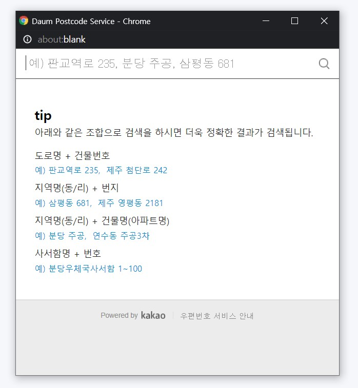

# react-daumpost-hook

[다음 우편 번호 API](http://postcode.map.daum.net/guide)를 리액트 커스텀 훅 방식으로 제공하는 플러그인.
간단하게 다음 우편번호 서비스 만을 기존 레이아웃에 가져다 붙이거나 팝업 형식으로 사용하기 편리하게 하기 위한 소스.
간단하게 가져다 쓰면서도 자유롭게 커스터마이징하기 용이합니다.

## 스크린샷




## 설치

```shell
npm install --save react-daumpost-hook
```

## 사용법

```js
import React, { useRef } from 'react';
import ReactDaumPost from 'react-daumpost-hook';

const App = function () {
    const ref = useRef(null);

    const postConfig = {
        ref : ref,
        onComplete : (data) => {
            console.log(data);
        }
    };
    const postCode = ReactDaumPost(postConfig);
   
    return (
        <main>
            test
            <input type="text"  onClick={() => postCode()} />
            <div ref={ref}></div>
        </main>
    );
};
```

### react-hook-form을 같이 쓸 경우

```js
import React, { useRef } from 'react';
import ReactDaumPost from 'react-daumpost-hook';
import { useForm } from 'react-hook-form';


const App = function () {
    const { setValue, handleSubmit } = useForm();
    const ref = useRef(null);
    
    const postConfig = {
        ref : ref,
        onComplete : (data) => {
        setValue('test', "tasdasdsasd");
        handleSubmit((data) => console.log(data))();
        }
    };
    const postCode = ReactDaumPost(postConfig);
   
    return (
        <main>
            test
            <input type="text"  onClick={() => postCode()} />
            <div ref={ref}></div>
        </main>
    );
};
```

## 설명

```js
import ReactDaumPost from 'react-daumpost-hook';
```
에서 불러온 ReactDaumPost 함수를 실행시키면 다음 우편 주소 API 스크립트를 로딩하며 해당 주소 API를 실행 시킬 수 있는 함수를 반환합니다.
반환 된 함수를 원하시는 컴포넌트의 이벤트에 연결하시면 다음 우편주소 API를 사용 하실 수 있습니다.
ReactDaumPost Hook을 실행시킬때 임의의 config객체를 인자로 넘겨서 API를 설정합니다.

### CONFIG 구성

1. **ref (?ref)** : 다음 API 포스트코드 검색창을 삽입시킬 컴포넌트입니다. useRef를 통해서 셀렉한 ref를 넘깁니다., **해당 속성을 비워두시면 자동으로 우편코드 검색 창을 팝업 방식**으로 띄웁니다.
2. **apiUrl (?string)** : 다음 API 스크립트 경로입니다. 선택사항이며 제공되는 API 경로가 변경된 경우 해당 값으로 변경해주시면 됩니다.
**기본값은 "t1.daumcdn.net/mapjsapi/bundle/postcode/prod/postcode.v2.js"** 입니다.
3. **method (?object)** : 다음 API에서 제공되는 **생성자들을 사용하실 경우 제공되는 인터페이스**입니다. 아래와 같이 객체를 생성하여서 method 인수로 넘겨주시면됩니다. 
```js
{
    onresize: function(size) {
        //size는 우편번호 찾기 화면의 크기 데이터 객체이며, 상세 설명은 아래 목록에서 확인하실 수 있습니다.
    },
    ononsearch : (state) =>{ ... },
    ...
}
```
자세한 내용은 [Daum Postcode API 가이드](http://postcode.map.daum.net/guide#usage)에서 참고해주시길 바랍니다.

4. **onComplete (?function)** : 포스트 API 검색 결과를 처리할 함수를 넘겨주시길바랍니다. 기본 값은 (data) => console.log(data)입니다.

***ref, apiUrl, method, onComplete 4가지 인자***를 객체 프로퍼티로 해당 커스텀훅에 넘겨서 사용 할 수 있으며 해당 인자들은 모두 선택사항이며  
***반드시 필요한 속성은 검색결과를 처리할 onComplete 하나***입니다. ref를 통해서 원하는 위치에 검색창을 삽입하시거나 팝업방식으로 간단히 API를  
이용가능하니 참고하셔서 사용해주시고 문의가 있을시 해당 Git Repo에 이슈로 등록해주시길 바랍니다.


### License

react-daumpost-hook is [MIT licensed](./LICENSE).